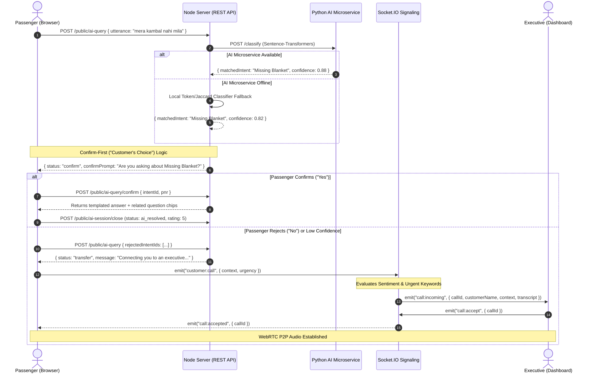
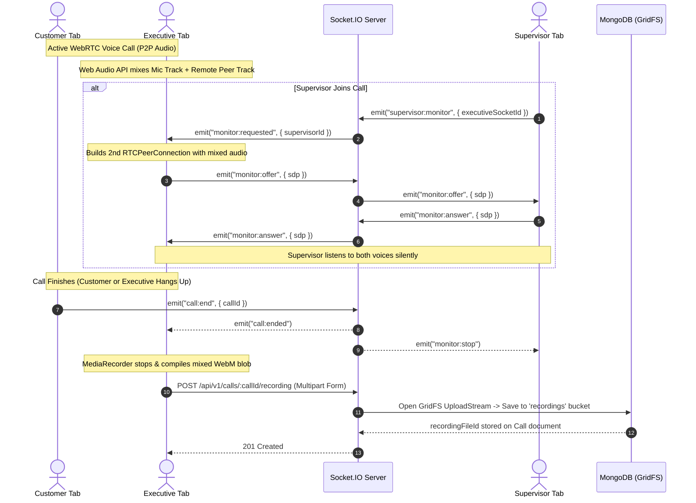
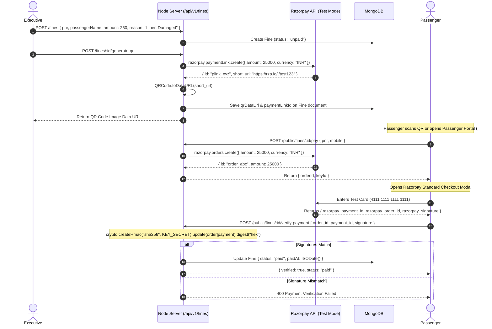
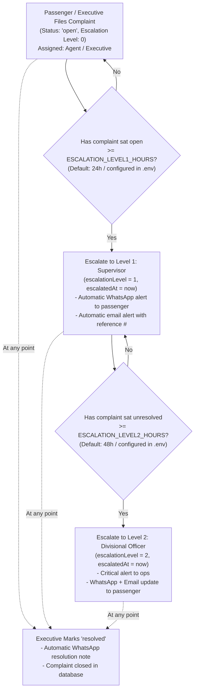
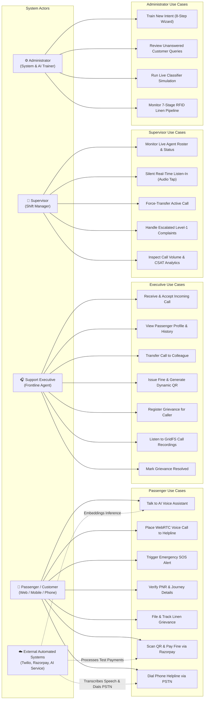

# SRLMS — Smart Railway Linen Management & AI Voice Calling System
### Comprehensive Architecture, System Design, Services Audit & Operational Guide

---

## 1. Executive Summary

**SRLMS (Smart Railway Linen Management System)** is an enterprise-grade railway passenger assistance and supply chain platform built for Indian Railways. It bridges modern AI voice assistance, real-time peer-to-peer browser calling, PSTN telephony, automated grievance redressal, fine collection, and IoT-based linen inventory tracking into a unified ecosystem.

The system is designed with an **"AI-First, Human-Escalated"** philosophy:
1. **Passengers** interact via voice or text with an AI assistant that understands English, Hindi, and Hinglish queries.
2. If the AI confidently resolves the inquiry, the issue is settled without human intervention.
3. If the query is complex, ambiguous, or flagged as an emergency (e.g., medical issues, theft, harassment, or SOS button activation), the system automatically routes the passenger through a sentiment-weighted priority queue to a live support executive via **browser-to-browser WebRTC voice calling**.
4. Calls can be recorded, supervisor-monitored in real time, or force-transferred.
5. Unresolved complaints climb a **CPGRAMS-style multi-tier escalation ladder** with automated WhatsApp and email dispatches.
6. Fines can be paid in-app via **Razorpay** or via scanned dynamic QR codes.
7. Linen kits are tracked across a 7-stage **RFID lifecycle**.

---

## 2. System Architecture Diagram

```mermaid
flowchart TB
    subgraph Client_Tier["1. CLIENT TIER (React 18 + Vite + Tailwind CSS)"]
        CP["Passenger Portal\n(#/passenger)\nPNR + Mobile Auth"]
        CS["Customer Voice Simulator\n(#/customer)\nSpeech In/Out + SOS"]
        ED["Executive Dashboard\n(#/)\nWebRTC Audio + Call Ops"]
        SD["Supervisor Console\n(#/supervisor)\nLive Monitor + Force-Transfer"]
        AD["Admin Training Studio\n(#/admin)\n8-Step KB Intent Wizard"]
        RD["RFID Tracker View\n(#/rfid)\nInventory Flow Diagram"]
        AN["Analytics Dashboard\n(#/analytics)\nVolume, Intents, CSAT"]
    end

    subgraph Gateway_Signaling["2. API GATEWAY & SIGNALING (Node.js + Express + Socket.IO)"]
        direction TB
        EXP["Express REST API (Port 4000)\nJWT Auth, Zod Validation,\nHelmet, Rate Limiters, MongoSanitize"]
        SIO["Socket.IO Signaling Server\nWebRTC SDP/ICE Relay,\nFIFO Priority Queue, Ring Timers,\nLive Executive Roster"]
        SWEEP["CPGRAMS Escalation Engine\n(Background setInterval Daemon)\nLevels 0 -> 1 -> 2 Escalation"]
        REC_UP["GridFS Audio Streamer\n(Multer MemoryStorage -> MongoDB)"]
    end

    subgraph AI_Intelligence["3. AI & SPEECH INTELLIGENCE TIER"]
        direction TB
        PY_FAST["Python FastAPI Microservice (Port 8001)\n(ai-service/main.py)"]
        ST_EMB["Sentence-Transformers\n(all-MiniLM-L6-v2)\nEmbeddings & Cosine Sim"]
        WHISPER["Faster-Whisper (base)\nLocal STT Engine"]
        PIPER["Piper TTS (ONNX)\nNeural Voice Generation"]
        LOCAL_FALLBACK["Node.js Local Fallback Engine\n(Token Jaccard + Keyword Scorer)\nZero-dependency backup"]
        BROWSER_SPEECH["Browser Web Speech API\n(webkitSpeechRecognition +\nspeechSynthesis fallback)"]
    end

    subgraph Database_Tier["4. PERSISTENCE LAYER (MongoDB Atlas / Docker)"]
        MONGO[("MongoDB Database (srlms)\nCollections: Users, Calls, Complaints,\nFines, Passengers, Trains, Rfid,\nKbCategories, KbIntents, UnansweredQueries")]
        GRIDFS[("MongoDB GridFS\n('recordings.files' & 'recordings.chunks')\nAudio WebM Recordings")]
    end

    subgraph External_Integrations["5. THIRD-PARTY & TELEPHONY INTEGRATIONS"]
        TW_VOICE["Twilio Voice (PSTN)\nInbound Phone Helpline\nPolly.Aditi TTS + Twilio STT"]
        TW_CB["Twilio Outbound Callbacks\nPSTN Mobile Bridging"]
        TW_WA["Twilio WhatsApp Sandbox\nAutomated Alerts (Join Code)"]
        RZP["Razorpay Gateway\nOrders API, Payment Links,\nHMAC-SHA256 Verification"]
        GMAIL["Gmail SMTP (Nodemailer)\nTransactional Emails & SOS Alerts"]
    end

    %% Interactions Client to Gateway
    CP -->|REST /public/* & /passengers/*| EXP
    CS -->|REST /public/ai-query & WebSockets| EXP
    CS <-->|WebRTC Signaling & Queue Events| SIO
    ED <-->|WebRTC Voice Signaling & Roster| SIO
    SD <-->|Supervisor Monitor Stream & Control| SIO
    AD -->|REST /kb/*| EXP
    RD -->|REST /rfid/*| EXP
    AN -->|REST /calls/analytics/*| EXP

    %% Audio and Browser features
    CS -.->|Local Mic/Speaker| BROWSER_SPEECH
    CS -->|Proxy /voice/stt & /voice/tts| EXP
    ED -->|Upload WebM Call Recording| REC_UP
    REC_UP --> GRIDFS

    %% Gateway to AI
    EXP -->|HTTP POST /classify, /stt, /tts| PY_FAST
    PY_FAST --> ST_EMB
    PY_FAST --> WHISPER
    PY_FAST --> PIPER
    EXP -.->|Fallback if AI Service is Offline| LOCAL_FALLBACK

    %% Gateway to DB
    EXP <--> MONGO
    SIO --> MONGO
    SWEEP <--> MONGO

    %% Gateway to 3rd Party
    EXP -->|Orders, Links, Signature Check| RZP
    EXP -->|Status & Escalation Notifications| TW_WA
    EXP -->|Email Confirmations & SOS Escalation| GMAIL
    EXP -->|Outbound Callbacks| TW_CB
    TW_VOICE <-->|Webhooks: /telephony/voice/*| EXP
```



---

## 3. Services & Components Breakdown

### 3.1. Client Tier (`client/`)
Built with **React 18**, **Vite**, **Tailwind CSS**, **Lucide Icons**, and **Recharts**. Uses custom hash-based routing (`App.jsx`) without external routing bloat.
*   **Customer Simulator (`CustomerSimulator.jsx` / `#/customer`)**:
    *   Public-facing voice/text interactive helpline.
    *   Fetches real trained FAQs (`GET /api/v1/public/faq`).
    *   Supports speech recognition (faster-whisper or `webkitSpeechRecognition`) and text-to-speech (Piper TTS or `speechSynthesis`).
    *   Features an explicit **Emergency SOS Button** that immediately notifies all connected staff and emails supervisors.
*   **Passenger Self-Service Portal (`PassengerPortal.jsx` / `#/passenger`)**:
    *   Lightweight authentication using **PNR + Mobile number** matching IRCTC's public portal model.
    *   Live booking retrieval (coach, berth, train status).
    *   Complaint filing with built-in duplicate detection (prevents double-filing within a rolling window).
    *   Fine viewing and direct **Razorpay Test Checkout** modal payment.
    *   Trilingual UI (English, Hindi, Hinglish) via local dictionary engine (`i18n.js`).
*   **Executive Dashboard (`ExecutiveDashboard.jsx` / `#/`)**:
    *   Full WebRTC call console for customer service agents.
    *   Displays incoming call metadata: caller name, PNR, AI matched topic, confidence score, and full AI conversation transcript.
    *   Automatic customer profile lookup displaying previous grievance counts and unpaid fines.
    *   Controls: Mute, Hang Up, Call Transfer to online colleagues.
    *   Action triggers: **Create Complaint**, **Generate Fine**, **Generate Dynamic QR**.
    *   Audio recording playback using an inline player fetching directly from GridFS.
*   **Supervisor Dashboard (`SupervisorDashboard.jsx` / `#/supervisor`)**:
    *   Live roster showing all registered executives, their current status (`available`, `busy`), current peer name, and call timers.
    *   **Silent Real-Time Listen-In**: Establishes a secondary, non-intrusive WebRTC audio stream from the executive's browser to the supervisor's browser.
    *   **Force-Transfer**: Moves an active call from one executive to another without either party redialing.
*   **Admin Training Dashboard (`AdminTrainingDashboard.jsx` / `#/admin`)**:
    *   8-Step Intent Creation Wizard: Category $\rightarrow$ Intent Name $\rightarrow$ Training Questions $\rightarrow$ Synonyms $\rightarrow$ Keywords $\rightarrow$ Action $\rightarrow$ Answer Template $\rightarrow$ Confidence Threshold.
    *   Live Tester: Simulates utterances against either Sentence-Transformers embeddings or the local lexical classifier.
    *   Unanswered Query Review Queue: Lists real queries that failed classification thresholds, allowing administrators to convert them into trained intents with one click.
*   **RFID Lifecycle Console (`RfidLifecycleView.jsx` / `#/rfid`)**:
    *   Visual 7-stage supply chain flow tracking linen kits through Laundry, Store, Transport, Train, Coach, Berth, and Return.
*   **Analytics Dashboard (`AnalyticsDashboard.jsx` / `#/analytics`)**:
    *   Recharts-powered analytics for call volume trends (14-day history), top grievance categories, CSAT star ratings (1–5 stars), and per-agent handle time/resolution rates.

### 3.2. Core Backend Server (`server/`)
Built with **Node.js**, **Express**, **Socket.IO**, and **Mongoose**.
*   **Express REST Gateway (`server/src/index.js`)**:
    *   Security layer: `helmet` headers, `express-mongo-sanitize` (NoSQL injection prevention), `cors`, and tiered rate limiters (`express-rate-limit` allowing 20 req/15 min for auth, 300 req/15 min general).
    *   Global error handling: `express-async-errors` prevents unhandled promise rejections from crashing the signaling daemon during active calls.
*   **WebRTC Signaling & Call Management (`server/src/socket/signaling.js`)**:
    *   Relays WebRTC SDP offers/answers and ICE candidates.
    *   Maintains in-memory state: `executives` map, `calls` map, and `waitQueue`.
    *   **Urgency & Sentiment Engine**: Heuristic scoring based on safety keywords, frustration markers, exclamations, and ALL-CAPS ratios; emergency cases automatically bypass the queue.
    *   **Ring-Cycling Engine**: Rings available executives sequentially with a 25-second timeout; if declined or timed out, the next agent is auto-dialed without dropping the customer.
*   **CPGRAMS Auto-Escalation Engine (`server/src/utils/escalation.js`)**:
    *   Background daemon running every 10 minutes via `setInterval`.
    *   Evaluates open complaints against configurable time thresholds: Level 0 (Executive) $\rightarrow$ Level 1 (Supervisor) $\rightarrow$ Level 2 (Divisional Officer).
    *   Dispatches multi-channel alerts (WhatsApp + Email) on each escalation step.
*   **GridFS Recording Pipeline (`server/src/routes/calls.js`)**:
    *   Receives mixed dual-channel WebM audio blobs from the executive's browser via `multer.memoryStorage()`.
    *   Streams directly into MongoDB's `recordings` GridFS bucket and provides chunked download/streaming endpoints (`GET /api/v1/calls/:callId/recording`).

### 3.3. Local AI Microservice (`ai-service/`)
A lightweight, self-hosted Python microservice built with **FastAPI** and **Uvicorn** (`main.py`).
*   **Embeddings Classifier (`POST /classify`)**: Uses Hugging Face's `sentence-transformers/all-MiniLM-L6-v2` (~80MB). Generates 384-dimensional dense vector embeddings for input utterances and pre-computed training questions/synonyms, calculating cosine similarity via NumPy.
*   **Speech-to-Text (`POST /stt`)**: Uses `faster-whisper` (OpenAI Whisper optimized via CTranslate2, `base` model in `int8` quantization on CPU) to transcribe multi-format audio uploads.
*   **Text-to-Speech (`POST /tts`)**: Uses Rhasspy `piper-tts` to synthesize speech using ONNX neural models (`en_US-lessac-medium`), streaming clean WAV audio buffers back.

---

## 4. End-to-End Operational Workflows

### 4.1. AI-First "Confirm-First" Conversation & Escalation



### 4.2. WebRTC Call Audio, Dual-Mixing, Recording & Supervision



### 4.3. Fine Generation, Dynamic QR Code & Razorpay Checkout



### 4.4. CPGRAMS Multi-Tier Grievance Auto-Escalation Ladder



---

## 5. Third-Party Integrations Audit

| Service / Dependency | Exact Role & Use Case | Location in Code | In `.env`? | Real Implementation Status | Operational Caveats / Limitations |
|---|---|---|---|---|---|
| **MongoDB Atlas** | Primary DB for operational data and binary audio storage via GridFS. | `server/src/db.js`, `models/*`, `routes/calls.js` | `MONGO_URI` | **Fully Functional** | Current replica set is live on Atlas. Also supports local Docker MongoDB (`--profile local-db`). |
| **Razorpay Gateway** | Payment processing for railway passenger fines (Orders, Checkout Modal, Payment Links, Dynamic QR Codes). | `server/src/routes/fines.js`, `routes/public.js` | `RAZORPAY_KEY_ID`, `RAZORPAY_KEY_SECRET` | **Fully Functional (Test Mode)** | Live and functional in Test Mode with test cards. Real money movement requires Razorpay corporate KYC verification. |
| **Twilio Voice (Inbound)** | Public telephone helpline. Transcribes passenger speech (`SpeechResult`) and runs Polly TTS. | `server/src/routes/telephony.js` | `TWILIO_ACCOUNT_SID`, `TWILIO_AUTH_TOKEN`, `TWILIO_PHONE_NUMBER` | **Fully Functional (Trial Mode)** | Receives real phone calls via ngrok webhook. Free trial includes 1 phone number and 75 minutes. |
| **Twilio Voice (Outbound Callback)** | Dialing a passenger's actual mobile number when WebRTC lines are busy or an agent triggers a callback. | `server/src/utils/twilioCall.js`, `routes/voice.js` | `TWILIO_EXECUTIVE_FALLBACK_NUMBER` | **Functional (Trial Restricted)** | Inline TwiML requires no public ngrok tunnel. Trial accounts can only dial numbers pre-verified in the Twilio Console. |
| **Twilio WhatsApp** | Automated passenger notifications for complaint registration, resolution, fines, and escalation. | `server/src/utils/whatsapp.js`, `routes/telephony.js` | `TWILIO_WHATSAPP_FROM`, `TWILIO_WHATSAPP_JOIN_CODE` | **Functional (Sandbox Mode)** | Twilio Sandbox constraint: Recipients must first message the sandbox number once with the join code (e.g., `join twilio-trial`). |
| **Gmail SMTP (Nodemailer)** | Transactional emails for fine payment QR attachments, complaint receipts, and emergency SOS alerts. | `server/src/utils/email.js`, `socket/signaling.js` | `EMAIL_USER`, `EMAIL_PASS`, `SOS_ALERT_EMAIL` | **Fully Functional** | Uses Google App Passwords (`oukvxrolfgavjimw`). If credentials are empty, silently skips without crashing. |
| **Sentence-Transformers** | Dense vector semantic embeddings (`all-MiniLM-L6-v2`) for intent matching in Hindi/English/Hinglish. | `ai-service/main.py` | `AI_SERVICE_URL` | **Fully Functional (Self-Hosted)** | Runs locally in Python microservice. If offline, the Node backend automatically falls back to token/Jaccard scoring. |
| **Faster-Whisper** | High-accuracy local speech-to-text on uploaded audio recordings. | `ai-service/main.py`, `server/src/routes/voice.js` | Proxied via Node `/voice/stt` | **Fully Functional (Self-Hosted)** | Runs locally on CPU via CTranslate2 (`base` model). Client automatically falls back to browser Web Speech API if down. |
| **Piper TTS** | High-speed neural text-to-speech generating natural Indian/English spoken audio. | `ai-service/main.py`, `server/src/routes/voice.js` | `PIPER_VOICE_PATH` | **Functional with Model File** | Requires ONNX voice file (`en_US-lessac-medium`). Client automatically falls back to browser `speechSynthesis` if down. |
| **Web Speech API** | Browser-native speech recognition and speech synthesis. | `client/src/voice.js` | N/A (Native browser API) | **Fully Functional** | Speech recognition is natively supported in Chromium browsers (Chrome, Edge); falls back to typing in Firefox/Safari. |
| **WebRTC & Web Audio API** | Real-time P2P browser calling, dual-channel audio mixing, and supervisor monitoring. | `client/src/useCallEngine.js`, `client/src/callRecorder.js`, `server/src/socket/signaling.js` | `JWT_SECRET` | **Fully Functional & Free Forever** | Relies on Google public STUN (`stun.l.google.com:19302`) and local Socket.IO signaling. No third-party media server costs. |
| **QRCode (npm)** | Generates base64 data URLs for scannable Razorpay payment links. | `server/src/routes/fines.js` | N/A (Local npm module) | **Fully Functional** | Encodes payment link URLs directly on the server for instant modal rendering and email attachments. |
| **Ngrok** | Exposes local port 4000 to the public web for Twilio inbound webhooks during development. | External developer CLI tool | N/A | **Utility / Functional** | Only necessary when testing inbound phone calls or inbound WhatsApp messages from external mobile networks. |

---

## 6. Use Case Diagram & Actor Specifications



---

## 7. Key Codebase References

*   **REST Server Entrypoint**: [`server/src/index.js`](file:///c:/AI%20Calling/AI%20Calling/server/src/index.js)
*   **WebRTC Signaling & Queue Logic**: [`server/src/socket/signaling.js`](file:///c:/AI%20Calling/AI%20Calling/server/src/socket/signaling.js)
*   **AI Classifier & Fallbacks**: [`server/src/utils/classifier.js`](file:///c:/AI%20Calling/AI%20Calling/server/src/utils/classifier.js)
*   **Urgency & Sentiment Scorer**: [`server/src/utils/sentiment.js`](file:///c:/AI%20Calling/AI%20Calling/server/src/utils/sentiment.js)
*   **CPGRAMS Auto-Escalation Sweep**: [`server/src/utils/escalation.js`](file:///c:/AI%20Calling/AI%20Calling/server/src/utils/escalation.js)
*   **Fines, QR & Razorpay APIs**: [`server/src/routes/fines.js`](file:///c:/AI%20Calling/AI%20Calling/server/src/routes/fines.js)
*   **Passenger Portal APIs**: [`server/src/routes/public.js`](file:///c:/AI%20Calling/AI%20Calling/server/src/routes/public.js)
*   **Twilio Telephony & Webhooks**: [`server/src/routes/telephony.js`](file:///c:/AI%20Calling/AI%20Calling/server/src/routes/telephony.js)
*   **GridFS Recording Upload & Streaming**: [`server/src/routes/calls.js`](file:///c:/AI%20Calling/AI%20Calling/server/src/routes/calls.js)
*   **Python AI Service (Embeddings/Whisper/Piper)**: [`ai-service/main.py`](file:///c:/AI%20Calling/AI%20Calling/ai-service/main.py)
*   **Frontend Main Router**: [`client/src/App.jsx`](file:///c:/AI%20Calling/AI%20Calling/client/src/App.jsx)
*   **WebRTC Audio Client Engine**: [`client/src/useCallEngine.js`](file:///c:/AI%20Calling/AI%20Calling/client/src/useCallEngine.js)
*   **Dual-Channel Audio Mixer & Recorder**: [`client/src/callRecorder.js`](file:///c:/AI%20Calling/AI%20Calling/client/src/callRecorder.js)
*   **Client Voice Driver (STT/TTS Fallbacks)**: [`client/src/voice.js`](file:///c:/AI%20Calling/AI%20Calling/client/src/voice.js)
*   **Active Server Environment Variables**: [`server/.env`](file:///c:/AI%20Calling/AI%20Calling/server/.env)

---

## 8. Quickstart & Local Setup Guide

### 8.1. Prerequisites
*   Node.js 18+ and npm
*   Python 3.10+ (optional, only needed for local AI microservice)
*   MongoDB Atlas connection string or local MongoDB instance

### 8.2. Installation
```bash
# 1. Install Backend Dependencies
cd server
npm install

# 2. Install Frontend Dependencies
cd ../client
npm install

# 3. (Optional) Setup Python AI Microservice
cd ../ai-service
python -m venv venv
# Windows:
venv\Scripts\activate
# Linux/macOS:
source venv/bin/activate
pip install -r requirements.txt
```

### 8.3. Running the Stack
```bash
# Terminal 1: Backend Server (Port 4000)

npm run seed     # Seeds demo trains, passengers, RFID tags, and users
npm start

# Terminal 2: Frontend Vite App (Port 5173)
cd client
npm run dev

# Terminal 3 (Optional): AI Microservice (Port 8001)
cd ai-service
uvicorn main:app --port 8001 --reload
```

Open **http://localhost:5173** in your browser:
*   **Staff Login (`#/staff-login`)**: Use seeded credentials (e.g. `priya` / `password123` for Executive, `supervisor` / `password123` for Supervisor, `admin` / `password123` for Admin).
*   **Customer Calling Simulator**: Open **http://localhost:5173/#/customer** in an Incognito tab.
*   **Passenger Self-Service Portal**: Open **http://localhost:5173/#/passenger** (enter PNR `PNR-1001` and mobile `9876543210` from seeded data).
